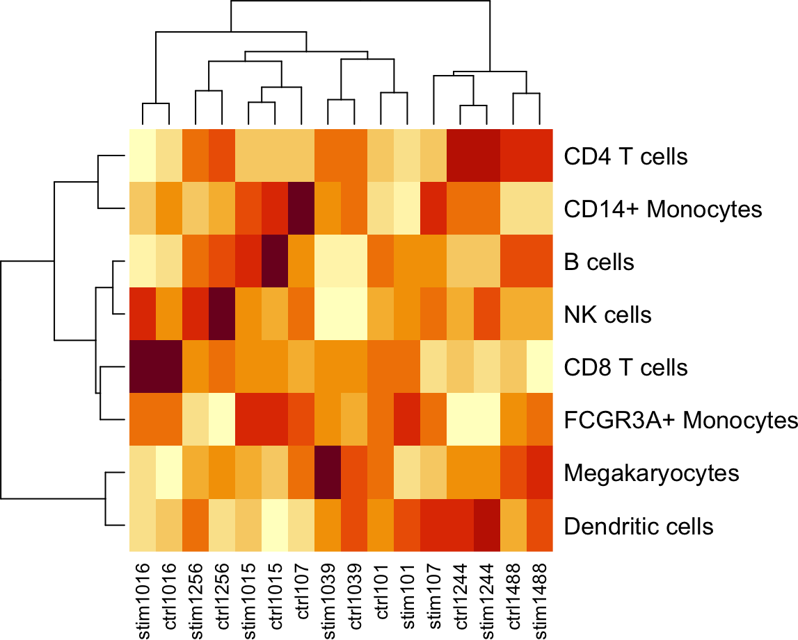
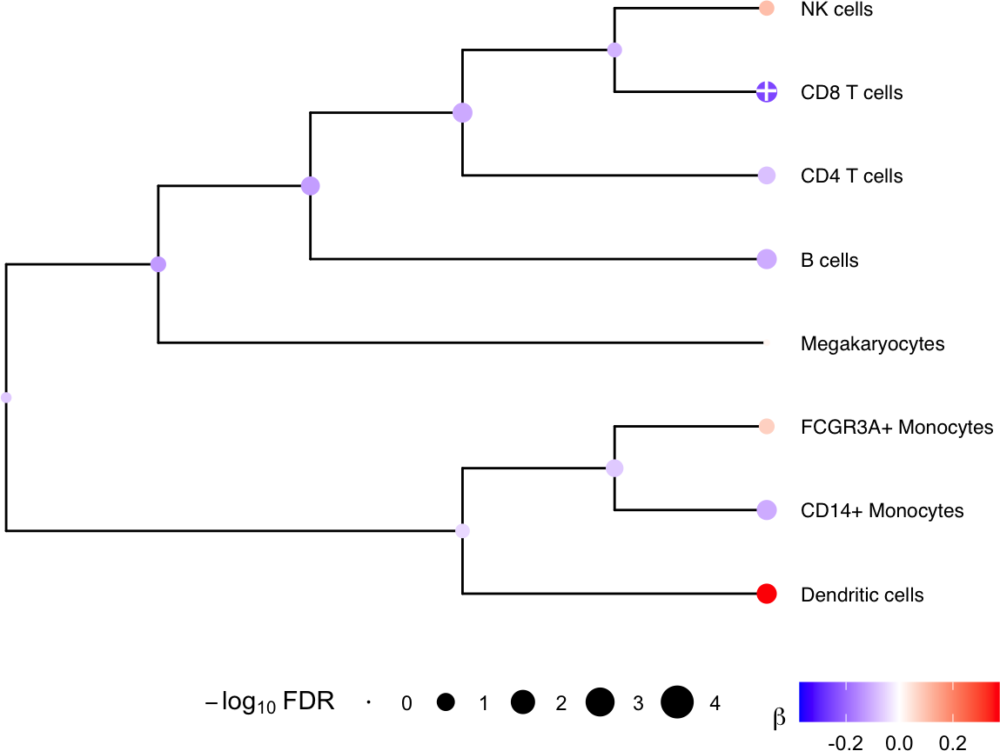

# Using crumblr in practice

### Introduction

Changes in cell type composition play an important role in health and
disease. Recent advances in single cell technology have enabled
measurement of cell type composition at increasing cell lineage
resolution across large cohorts of individuals. Yet this raises new
challenges for statistical analysis of these compositional data to
identify changes associated with a phenotype. We introduce `crumblr`, a
scalable statistical method for analyzing count ratio data using
precision-weighted linear models incorporating random effects for
complex study designs. Uniquely, `crumblr` performs tests of association
at multiple levels of the cell lineage hierarchy using multivariate
regression to increase power over tests of a single cell component. In
simulations, `crumblr` increases power compared to existing methods,
while controlling the false positive rate.

The `crumblr` package integrates with the
[`variancePartition`](https://www.bioconductor.org/packages/variancePartition/)
and [`dreamlet`](https://www.bioconductor.org/packages/dreamlet/)
packages in the Bioconductor ecosystem.

Here we consider counts for 8 cell types from quantified using single
cell RNA-seq data from unstimulated and interferon β stimulated PBMCs
from 8 subjects [(Kang, et al.,
2018)](https://www.nature.com/articles/nbt.4042).

The functions here incorporate the precision weights:

- [`variancePartition::fitExtractVarPartModel()`](http://DiseaseNeurogenomics.github.io/variancePartition/reference/fitExtractVarPartModel-method.md)
- [`variancePartition::dream()`](http://DiseaseNeurogenomics.github.io/variancePartition/reference/dream-method.md)
- [`limma::lmFit()`](https://rdrr.io/pkg/limma/man/lmFit.html)

## Installation

To install this package, start R and enter:

\
`# 1) Make sure Bioconductor is installed`\
`if`` ``(``!`[`require`](https://rdrr.io/r/base/library.html)`(`[`"BiocManager"`](https://bioconductor.github.io/BiocManager/)`, quietly ``=`` ``TRUE``)``)`` ``{`\
`  `[`install.packages`](https://rdrr.io/r/utils/install.packages.html)`(``"BiocManager"``)`\
`}`\
\
`# 2) Install crumblr and dependencies:`\
`# From Bioconductor`\
`BiocManager``::`[`install`](https://bioconductor.github.io/BiocManager/reference/install.html)`(``"crumblr"``)`

## Analysis workflow

### Process data

Here we evaluate whether the observed cell proportions change in
response to interferon β. Given the results here, we cannot reject the
null hypothesis that interferon β does not affect the cell type
proportions.

\
[`library`](https://rdrr.io/r/base/library.html)`(`[`crumblr`](https://DiseaseNeurogenomics.github.io/crumblr)`)`\
\
`# Load cell counts, clustering and metadata`\
`# from Kang, et al. (2018) https://doi.org/10.1038/nbt.4042`\
[`data`](https://rdrr.io/r/utils/data.html)`(``IFNCellCounts``)`\
\
`# Apply crumblr transformation`\
`# cobj is an EList object compatable with limma workflow`\
`# cobj$E stores transformed values`\
`# cobj$weights stores precision weights`\
`#    corresponding to the regularized inverse variance`\
`cobj`` ``<-`` `[`crumblr`](http://DiseaseNeurogenomics.github.io/crumblr/reference/crumblr.md)`(``df_cellCounts``)`

### Variance partitioning

Decomposing the variance illustrates that more variation is explained by
subject than stimulation status.

\
[`library`](https://rdrr.io/r/base/library.html)`(`[`variancePartition`](http://bioconductor.org/packages/variancePartition)`)`\
\
`# Partition variance into components for Subject (i.e. ind)`\
`#   and stimulation status, and residual variation`\
`form`` ``<-`` ``~`` ``(``1`` ``|`` ``ind``)`` ``+`` ``(``1`` ``|`` ``StimStatus``)`\
`vp`` ``<-`` `[`fitExtractVarPartModel`](http://DiseaseNeurogenomics.github.io/variancePartition/reference/fitExtractVarPartModel-method.md)`(``cobj``, ``form``, ``info``)`\
\
`# Plot variance fractions`\
`fig.vp`` ``<-`` `[`plotPercentBars`](http://DiseaseNeurogenomics.github.io/variancePartition/reference/plotPercentBars-method.md)`(``vp``)`\
`fig.vp`

### PCA

Performing PCA on the transformed cell counts indicates that the samples
cluster based on subject rather than stimulation status. Here, we use
[`standardize()`](http://DiseaseNeurogenomics.github.io/crumblr/reference/standardize-method.md)
so that each observation has approximately equal variance
(i.e. homoscedasticity) by dividing the CLR transformed frequencies by
their estimated sampling standard deviation. Transforming the data to be
approximately homoscedastic has been
[shown](https://genomebiology.biomedcentral.com/articles/10.1186/s13059-014-0550-8)
to improve performance of PCA.

\
[`library`](https://rdrr.io/r/base/library.html)`(`[`ggplot2`](https://ggplot2.tidyverse.org)`)`\
\
`# Perform PCA`\
`# use crumblr::standardize() to get values with`\
`# approximately equal sampling variance,`\
`# which is a key property for downstream PCA and clustering analysis.`\
`pca`` ``<-`` `[`prcomp`](https://rdrr.io/r/stats/prcomp.html)`(`[`t`](https://rdrr.io/r/base/t.html)`(`[`standardize`](http://DiseaseNeurogenomics.github.io/crumblr/reference/standardize-method.md)`(``cobj``)``)``)`\
\
`# merge with metadata`\
`df_pca`` ``<-`` `[`merge`](https://rdrr.io/r/base/merge.html)`(``pca``$``x``, ``info``, by ``=`` ``"row.names"``)`\
\
`# Plot PCA`\
`#   color by Subject`\
`#   shape by Stimulated vs unstimulated`\
[`ggplot`](https://ggplot2.tidyverse.org/reference/ggplot.html)`(``df_pca``, `[`aes`](https://ggplot2.tidyverse.org/reference/aes.html)`(``PC1``, ``PC2``, color ``=`` `[`as.character`](https://rdrr.io/r/base/character.html)`(``ind``)``, shape ``=`` ``StimStatus``)``)`` ``+`\
`  `[`geom_point`](https://ggplot2.tidyverse.org/reference/geom_point.html)`(``size ``=`` ``3``)`` ``+`\
`  `[`theme_classic`](https://ggplot2.tidyverse.org/reference/ggtheme.html)`(``)`` ``+`\
`  `[`theme`](https://ggplot2.tidyverse.org/reference/theme.html)`(``aspect.ratio ``=`` ``1``)`` ``+`\
`  `[`scale_color_discrete`](https://ggplot2.tidyverse.org/reference/scale_colour_discrete.html)`(``name ``=`` ``"Subject"``)`` ``+`\
`  `[`xlab`](https://ggplot2.tidyverse.org/reference/labs.html)`(``"PC1"``)`` ``+`\
`  `[`ylab`](https://ggplot2.tidyverse.org/reference/labs.html)`(``"PC2"``)`

### Hierarchical clustering

The samples from the same subject also cluster together.

\
[`heatmap`](https://rdrr.io/r/stats/heatmap.html)`(``cobj``$``E``)`

### Differential testing

\
`# Use variancePartition workflow to analyze each cell type`\
`# Perform regression on each cell type separately`\
`#  then use eBayes to shrink residual variance`\
`# Also compatible with limma::lmFit()`\
`fit`` ``<-`` `[`dream`](http://DiseaseNeurogenomics.github.io/variancePartition/reference/dream-method.md)`(``cobj``, ``~`` ``StimStatus`` ``+`` ``ind``, ``info``)`\
`fit`` ``<-`` ``eBayes``(``fit``)`\
\
`# Extract results for each cell type`\
`topTable``(``fit``, coef ``=`` ``"StimStatusstim"``, number ``=`` ``Inf``)`

    ##                         logFC    AveExpr          t     P.Value  adj.P.Val         B
    ## CD8 T cells       -0.25085170  0.0857175 -4.0787416 0.002436375 0.01949100 -1.279815
    ## Dendritic cells    0.37386979 -2.1849234  3.1619195 0.010692544 0.02738587 -2.638507
    ## CD14+ Monocytes   -0.10525402  1.2698117 -3.1226341 0.011413912 0.02738587 -2.709377
    ## B cells           -0.10478652  0.5516882 -3.0134349 0.013692935 0.02738587 -2.940542
    ## CD4 T cells       -0.07840101  2.0201947 -2.2318104 0.050869691 0.08139151 -4.128069
    ## FCGR3A+ Monocytes  0.07425165 -0.2567492  1.6647681 0.128337022 0.17111603 -4.935304
    ## NK cells           0.10270672  0.3797777  1.5181860 0.161321761 0.18436773 -5.247806
    ## Megakaryocytes     0.01377768 -1.8655172  0.1555131 0.879651456 0.87965146 -6.198336

#### Multivariate testing along a tree

We can gain power by jointly testing multiple cell types using a
multivariate statistical model, instead of testing one cell type at a
time. Here we construct a hierarchical clustering between cell types
based on gene expression from pseudobulk, and perform a multivariate
test for each internal node of the tree based on its leaf nodes. The
results for the leaves are the same as from `topTable()` above. At each
internal node
[`treeTest()`](http://DiseaseNeurogenomics.github.io/crumblr/reference/treeTest.md)
performs a fixed effects meta-analysis of the coefficients of the leaves
while modeling the covariance between coefficient estimates. In the
backend, this is implemented using
[`variancePartition::mvTest()`](http://DiseaseNeurogenomics.github.io/variancePartition/reference/mvTest-method.md)
and [remaCor](https://cran.r-project.org/package=remaCor) package.

Here the hierarchical clustering, `hcl`, is precomputed from pseudobulk
gene expression using `buildClusterTreeFromPB()`.

\
`# Perform multivariate test across the hierarchy`\
`res`` ``<-`` `[`treeTest`](http://DiseaseNeurogenomics.github.io/crumblr/reference/treeTest.md)`(``fit``, ``cobj``, ``hcl``, coef ``=`` ``"StimStatusstim"``)`\
\
`# Plot hierarchy and testing results`\
[`plotTreeTest`](http://DiseaseNeurogenomics.github.io/crumblr/reference/plotTreeTest.md)`(``res``)`

\
`# Plot hierarchy and regression coefficients`\
[`plotTreeTestBeta`](http://DiseaseNeurogenomics.github.io/crumblr/reference/plotTreeTestBeta.md)`(``res``)`

##### Combined plotting

\
[`plotTreeTestBeta`](http://DiseaseNeurogenomics.github.io/crumblr/reference/plotTreeTestBeta.md)`(``res``)`` ``+`\
`  `[`theme`](https://ggplot2.tidyverse.org/reference/theme.html)`(``legend.position ``=`` ``"bottom"``, legend.box ``=`` ``"vertical"``)`` ``|`\
`  `[`plotForest`](http://DiseaseNeurogenomics.github.io/crumblr/reference/plotForest-methods.md)`(``res``, hide ``=`` ``FALSE``)`` ``|`\
`  ``fig.vp`

\

### Hierarchical clustering

The hierarchical clustering used by
[`treeTest()`](http://DiseaseNeurogenomics.github.io/crumblr/reference/treeTest.md)
can be computed a number of ways, depending on the available data and
biological question. For example, see
[Article](http://DiseaseNeurogenomics.github.io/crumblr/articles/integration.md)
for details about how hierarchical clustering was run in this dataset.

In general, hierarchical clustering can be computed from

- pseudobulked single cell gene expression

\
`hcl`` ``<-`` ``buildClusterTreeFromPB``(``pb``)`

- cell type frequencies

\
`# correlation matrix between all cell types`\
`C`` ``<-`` `[`cor`](https://rdrr.io/r/stats/cor.html)`(`[`t`](https://rdrr.io/r/base/t.html)`(`[`standardize`](http://DiseaseNeurogenomics.github.io/crumblr/reference/standardize-method.md)`(``cobj``)``)``)`\
\
`# convert to distance`\
`dm`` ``<-`` `[`as.dist`](https://rdrr.io/r/stats/dist.html)`(``1`` ``-`` `[`abs`](https://rdrr.io/r/base/MathFun.html)`(``C``)``)`\
\
`# eval hierarchical clustering`\
`hcl`` ``<-`` `[`hclust`](https://rdrr.io/r/stats/hclust.html)`(``dm``)`

- [Newick formated](https://en.wikipedia.org/wiki/Newick_format) tree
  computed from external data

\
`# Make sure packages are installed`\
`# BiocManager::install(c("ctc", "ape", "phylogram"))`\
[`library`](https://rdrr.io/r/base/library.html)`(`[`ape`](https://github.com/emmanuelparadis/ape)`)`\
[`library`](https://rdrr.io/r/base/library.html)`(``ctc``)`\
[`library`](https://rdrr.io/r/base/library.html)`(`[`phylogram`](https://docs.ropensci.org/phylogram)`)`\
[`library`](https://rdrr.io/r/base/library.html)`(`[`tidyverse`](https://tidyverse.tidyverse.org)`)`\
\
`# Write tree to file, `\
`# edit manually`\
`# then read back into R`\
`# `\
\
`# Specify tree as text in Newick format`\
`txt`` ``=`` ``"((CD14+ Monocytes,(B cells,(Dendritic cells,Megakaryocytes))),(CD8 T cells,(NK cells,(CD4 T cells,FCGR3A+ Monocytes))));"`\
\
`# read from text`\
`hcl_from_txt`` ``<-`` `[`read.tree`](https://rdrr.io/pkg/ape/man/read.tree.html)`(``text ``=`` ``txt``)`` `[`%>%`](https://magrittr.tidyverse.org/reference/pipe.html)\
`                  ``as.dendrogram.phylo`` `[`%>%`](https://magrittr.tidyverse.org/reference/pipe.html)\
`                  ``as.hclust`\
\
`# Alternatively, `\
`# write existing tree to file`\
`# and edit manaully`\
[`write`](https://rdrr.io/r/base/write.html)`(``hc2Newick``(``hcl``)``,file``=``'hcl.nwk'``)`\
\
`hcl_from_txt2`` ``<-`` `[`read.tree`](https://rdrr.io/pkg/ape/man/read.tree.html)`(``file ``=`` ``'hcl.nwk'``)`` `[`%>%`](https://magrittr.tidyverse.org/reference/pipe.html)\
`                  ``as.dendrogram.phylo`` `[`%>%`](https://magrittr.tidyverse.org/reference/pipe.html)\
`                  ``as.hclust`

## Considerations

### Computational scaling

The
[`crumblr()`](http://DiseaseNeurogenomics.github.io/crumblr/reference/crumblr.md)
workflow is very fast, especially compared to more demanding
differential expression analysies. Applying
[`crumblr()`](http://DiseaseNeurogenomics.github.io/crumblr/reference/crumblr.md)
requires \<1 sec, even for very large datsets. Differential testing with
[`dream()`](http://DiseaseNeurogenomics.github.io/variancePartition/reference/dream-method.md)
takes \< 10 seconds for fixed effects models and \< 30 seconds for mixed
models with typical sample sizes and number of cell types. Running
[`treeTest()`](http://DiseaseNeurogenomics.github.io/crumblr/reference/treeTest.md)
can be a little more demanding, but should finish in \< 30 seconds with
20 cell types.

### Complex study designs

The
[`crumblr()`](http://DiseaseNeurogenomics.github.io/crumblr/reference/crumblr.md)
workflow can handle complex study designs with repeated measures or
multiple random effects.
[`dream()`](http://DiseaseNeurogenomics.github.io/variancePartition/reference/dream-method.md)
uses [`lme4::lmer()`](https://rdrr.io/pkg/lme4/man/lmer.html) in the
backend to fit weighted linear mixed models. Considerations about
defining the regression model are described in documentation to
[`variancePartition`](https://diseaseneurogenomics.github.io/variancePartition)
or this
[book](https://people.math.ethz.ch/~maechler/MEMo-pages/lMMwR.pdf) by
the author of `lme4`.

### Tuning parameters

[`crumblr()`](http://DiseaseNeurogenomics.github.io/crumblr/reference/crumblr.md)
uses two tuning parameters accessable to the user. These are fixed to
default values in all simulations and data analysis. *The user is
strongly recommended to keep these dfault values*.

- In order to deal with zero counts,
  [`crumblr()`](http://DiseaseNeurogenomics.github.io/crumblr/reference/crumblr.md)
  uses a pseudocount (default: 0.5) added to all observed counts.

- For real data, the asymptotic variance formula can give weights that
  vary substantially across samples and give very high weights for a
  subset of samples. In order to address this, we regularize the weights
  to reduce the variation in the weights to have a maximum ratio
  (default of 5) between the maximum and specified quantile value
  (default of 5%).

## Session Info

    ## R version 4.5.1 (2025-06-13)
    ## Platform: aarch64-apple-darwin23.6.0
    ## Running under: macOS Sonoma 14.7.1
    ## 
    ## Matrix products: default
    ## BLAS/LAPACK: /opt/homebrew/Cellar/openblas/0.3.34/lib/libopenblasp-r0.3.34.dylib;  LAPACK version 3.12.0
    ## 
    ## locale:
    ## [1] en_US.UTF-8/en_US.UTF-8/en_US.UTF-8/C/en_US.UTF-8/en_US.UTF-8
    ## 
    ## time zone: America/New_York
    ## tzcode source: internal
    ## 
    ## attached base packages:
    ## [1] stats     graphics  grDevices utils     datasets  methods   base     
    ## 
    ## other attached packages:
    ##  [1] lubridate_1.9.5         forcats_1.0.1           stringr_1.6.0           dplyr_1.2.1            
    ##  [5] purrr_1.2.2             readr_2.2.0             tidyr_1.3.2             tibble_3.3.1           
    ##  [9] tidyverse_2.0.0         glue_1.8.1              variancePartition_2.0.1 BiocParallel_1.44.0    
    ## [13] limma_3.66.0            crumblr_1.4.5           ggplot2_4.0.3           BiocStyle_2.38.0       
    ## 
    ## loaded via a namespace (and not attached):
    ##   [1] RColorBrewer_1.1-3          jsonlite_2.0.0              magrittr_2.0.5             
    ##   [4] farver_2.1.2                nloptr_2.2.1                rmarkdown_2.32             
    ##   [7] fs_2.1.0                    ragg_1.5.2                  vctrs_0.7.3                
    ##  [10] minqa_1.2.8                 ggtree_4.0.5                htmltools_0.5.9            
    ##  [13] S4Arrays_1.10.1             broom_1.0.13                SparseArray_1.10.10        
    ##  [16] Formula_1.2-6               gridGraphics_0.5-1          sass_0.4.10                
    ##  [19] parallelly_1.48.0           KernSmooth_2.23-27          bslib_0.12.0               
    ##  [22] htmlwidgets_1.6.4           desc_1.4.3                  plyr_1.8.9                 
    ##  [25] pbkrtest_0.5.5              cachem_1.1.0                lifecycle_1.0.5            
    ##  [28] iterators_1.0.14            pkgconfig_2.0.3             Matrix_1.7-6               
    ##  [31] R6_2.6.1                    fastmap_1.2.0               rbibutils_2.4.1            
    ##  [34] MatrixGenerics_1.22.0       digest_0.6.39               numDeriv_2016.8-1.1        
    ##  [37] aplot_0.3.1                 patchwork_1.3.2             S4Vectors_0.48.1           
    ##  [40] DESeq2_1.50.2               textshaping_1.0.5           GenomicRanges_1.62.1       
    ##  [43] labeling_0.4.3              timechange_0.4.0            abind_1.4-8                
    ##  [46] mgcv_1.9-4                  compiler_4.5.1              fontquiver_0.2.1           
    ##  [49] aod_1.3.3                   withr_3.0.3                 S7_0.2.2                   
    ##  [52] backports_1.5.1             viridis_0.6.5               carData_3.0-6              
    ##  [55] gplots_3.3.0                MASS_7.3-66                 rappdirs_0.3.4             
    ##  [58] DelayedArray_0.36.1         corpcor_1.6.10              gtools_3.9.5               
    ##  [61] caTools_1.18.4              tools_4.5.1                 otel_0.2.0                 
    ##  [64] ape_5.8-1                   remaCor_0.0.20              nlme_3.1-171               
    ##  [67] grid_4.5.1                  reshape2_1.4.5              generics_0.1.4             
    ##  [70] gtable_0.3.6                tzdb_0.5.0                  hms_1.1.4                  
    ##  [73] car_3.1-5                   XVector_0.50.0              BiocGenerics_0.56.0        
    ##  [76] pillar_1.11.1               yulab.utils_0.2.5           splines_4.5.1              
    ##  [79] treeio_1.34.0               lattice_0.23-1              dirmult_0.1.3-5            
    ##  [82] tidyselect_1.2.1            fontLiberation_0.1.0        SingleCellExperiment_1.32.0
    ##  [85] locfit_1.5-9.12             knitr_1.52                  gridExtra_2.3.1            
    ##  [88] fontBitstreamVera_0.1.1     reformulas_0.4.4            bookdown_0.48              
    ##  [91] IRanges_2.44.0              Seqinfo_1.0.0               SummarizedExperiment_1.40.0
    ##  [94] RhpcBLASctl_0.23-42         stats4_4.5.1                xfun_0.61                  
    ##  [97] Biobase_2.70.0              statmod_1.5.2               matrixStats_1.5.0          
    ## [100] stringi_1.8.9               lazyeval_0.2.3              ggfun_0.2.1                
    ## [103] yaml_2.3.12                 boot_1.3-32                 evaluate_1.0.5             
    ## [106] codetools_0.2-20            gdtools_0.5.1               BiocManager_1.30.27        
    ## [109] ggplotify_0.1.3             cli_3.6.6                   RcppParallel_6.2.1         
    ## [112] systemfonts_1.3.2           Rdpack_2.6.6                jquerylib_0.1.4            
    ## [115] dichromat_2.0-1             Rcpp_1.1.2                  zigg_0.0.2                 
    ## [118] EnvStats_3.1.0              parallel_4.5.1              Rfast_2.1.5.2              
    ## [121] pkgdown_2.2.1               fastglmm_0.4.19             bitops_1.1-0               
    ## [124] lme4_2.1-0                  viridisLite_0.4.3           mvtnorm_1.4-2              
    ## [127] tidytree_0.4.8              ggiraph_0.9.6               lmerTest_3.2-1             
    ## [130] scales_1.4.0                fANCOVA_0.6-1               rlang_1.3.0
