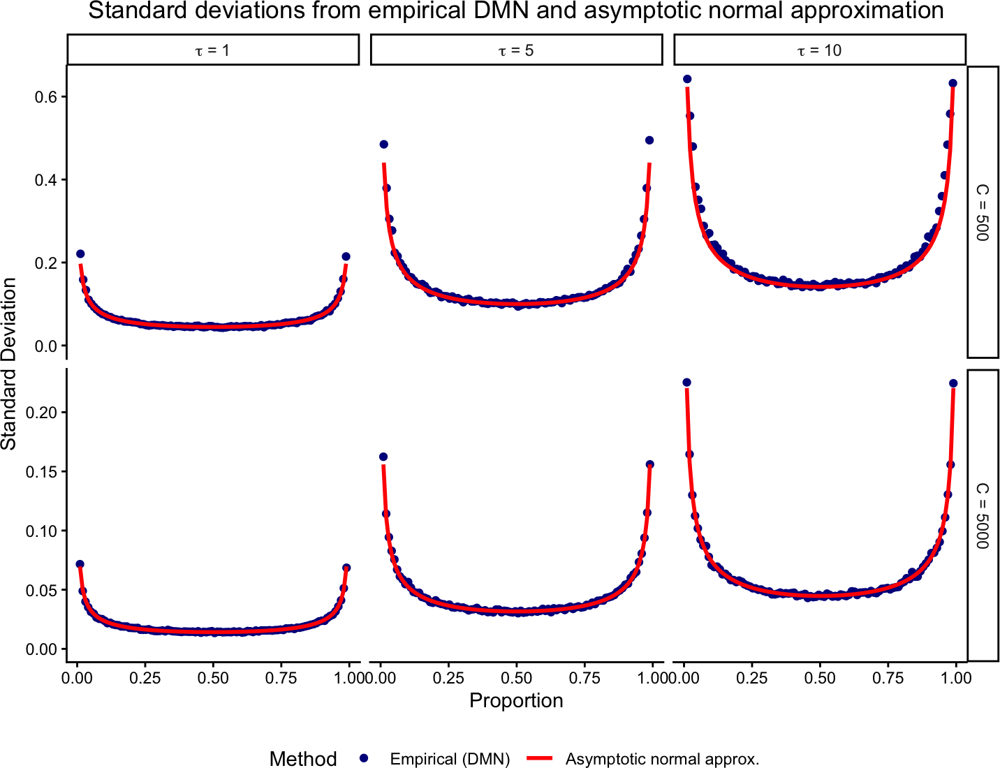
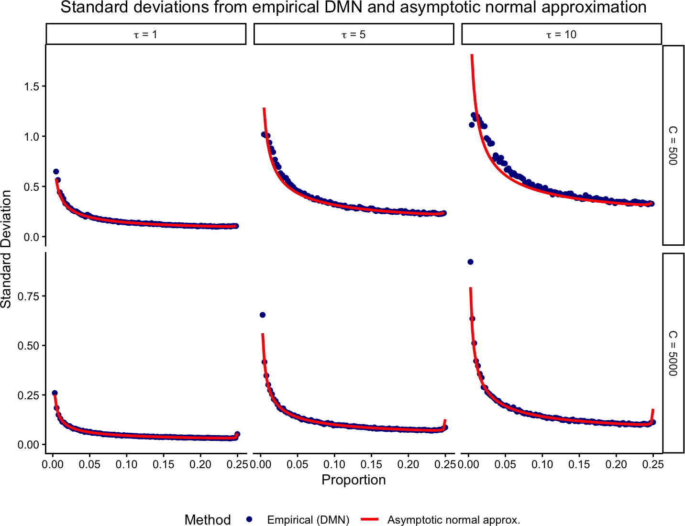

# Normal approximation vs. empirical simulation

### Asymptotic normal approximation

Let the vector \\{\bf p}\\ be the true fractions across \\D\\
categories. Consider \\C\\ total counts sampled from a
Dirichlet-multinomial (DMN) distribution with overdispersion \\\tau\\,
where \\\tau=1\\ reduces to the multinomial distribution. The [centered
log ratio](https://rdrr.io/cran/compositions/man/clr.html) (CLR) of the
\\i^{th}\\ estimated fraction, \\\hat p_i\\ is

\\\begin{equation} \tag{1} \text{clr}\_i({\bf \hat p}) = \log(\hat
p_i) - \frac{1}{D}\sum\_{j=1}^D \log(\hat p_j) \end{equation}\\

and we show that the sampling variance is

\\\text{var}\[\text{clr}(\hat p_i)\] = \frac{\tau}{C} \left\[
\frac{1}{\hat p_i} - \frac{2}{ D \hat p_i} + \frac{1}{D^2}\sum\_{j=1}^D
\frac{1}{\hat p_j} \right\] .\\

### Simulations

The sampling variance is derived from asymototic theory, so we examine
its behavior for finite total counts. Here we evaluate the empirical
variance from \\1,000\\ draws from a Dirichlet-multinomial distribution
while varying \\D\\, \\\tau\\, and \\C\\. A pseudocount of 0.5 is added
to the observed counts since the asymptotic theory is not defined for
counts of zero.

Here we plot the standard deviation after CLR transform from the
empirical DMN and the asymptotic normal approximation under a range of
conditions. Results are shown for instances with at least 2 counts.

#### D=2 categories

#### D=15 categories

#### Interpretation

The asymptotic standard deviation shows good agreement with the
empirical results even for small values of \\C\\, *when at least 2
counts are observed*. In practice, it is often reasonable to assume a
sufficient number of counts before a variable is included in an
analysis. Importantly, with less than 2 counts the asymptotic theory
gives a *larger* standard deviation than the emprical results (results
not shown). Therefore, this approach is conservative and should not
underestimate the true amount of variation. The asymptotic normal
approximation is most accurate for large total counts \\C\\, large
proportions \\p\\, and small overdispersion \\\tau\\.

##### Consideration of overdispersion

Based on Equation (2), the variance of the CLR-transformed proportions
is a *linear* function of \\\tau\\. Importantly, downstream analysis of
the CLR-transformed proportions with a precision-weighted linear (mixed)
model or a variance stabilizing transform depends only on the *relative*
variances. Since relative variances are invariant to the scale of
\\\tau\\, for these applications the value of \\\tau\\ can be set to 1
instead of being estimated from the data.

For other applications, `crumblr` can estimate \\\tau\\ from the data by
using `crumblr(counts, tau=NULL)`. This calls `dmn.mle()` to estimate
the parameters of the DMN distribution and is substantially faster than
alternatives.

But note that due the theoretical properties of the variance estimate of
CLR-transformed proportions, the precision weights are invariant to the
scale of \\\tau\\. We can see this empirically:

\
[`library`](https://rdrr.io/r/base/library.html)`(`[`crumblr`](https://DiseaseNeurogenomics.github.io/crumblr)`)`\
[`data`](https://rdrr.io/r/utils/data.html)`(``IFNCellCounts``)`\
\
`counts`` ``<-`` ``df_cellCounts`\
\
`# run crumblr with different tau values`\
`# show part of the weights matrix`\
[`crumblr`](http://DiseaseNeurogenomics.github.io/crumblr/reference/crumblr.md)`(``counts``, tau``=``1``)``$``weights``[``1``:``3``, ``1``:``3``]`

    ##                  ctrl101 ctrl1015 ctrl1016
    ## B cells         2.704599 5.000000 3.094438
    ## CD14+ Monocytes 1.822824 4.143929 2.716263
    ## CD4 T cells     2.044461 3.615231 2.433429

\
[`crumblr`](http://DiseaseNeurogenomics.github.io/crumblr/reference/crumblr.md)`(``counts``, tau``=``5``)``$``weights``[``1``:``3``, ``1``:``3``]`

    ##                  ctrl101 ctrl1015 ctrl1016
    ## B cells         2.704599 5.000000 3.094438
    ## CD14+ Monocytes 1.822824 4.143929 2.716263
    ## CD4 T cells     2.044461 3.615231 2.433429

\
[`crumblr`](http://DiseaseNeurogenomics.github.io/crumblr/reference/crumblr.md)`(``counts``, tau``=``NULL``)``$``weights``[``1``:``3``, ``1``:``3``]`

    ##                  ctrl101 ctrl1015 ctrl1016
    ## B cells         2.704599 5.000000 3.094438
    ## CD14+ Monocytes 1.822824 4.143929 2.716263
    ## CD4 T cells     2.044461 3.615231 2.433429

## Session Info

    ## R version 4.5.1 (2025-06-13)
    ## Platform: aarch64-apple-darwin23.6.0
    ## Running under: macOS Sonoma 14.7.1
    ## 
    ## Matrix products: default
    ## BLAS/LAPACK: /opt/homebrew/Cellar/openblas/0.3.34/lib/libopenblasp-r0.3.34.dylib;  LAPACK version 3.12.0
    ## 
    ## locale:
    ## [1] en_US.UTF-8/en_US.UTF-8/en_US.UTF-8/C/en_US.UTF-8/en_US.UTF-8
    ## 
    ## time zone: America/New_York
    ## tzcode source: internal
    ## 
    ## attached base packages:
    ## [1] parallel  stats     graphics  grDevices utils     datasets  methods   base     
    ## 
    ## other attached packages:
    ##  [1] dirmult_0.1.3-5  lubridate_1.9.5  forcats_1.0.1    stringr_1.6.0    dplyr_1.2.1     
    ##  [6] purrr_1.2.2      readr_2.2.0      tidyr_1.3.2      tibble_3.3.1     tidyverse_2.0.0 
    ## [11] glue_1.8.1       crumblr_1.4.5    ggplot2_4.0.3    BiocStyle_2.38.0
    ## 
    ## loaded via a namespace (and not attached):
    ##   [1] RColorBrewer_1.1-3          jsonlite_2.0.0              magrittr_2.0.5             
    ##   [4] farver_2.1.2                nloptr_2.2.1                rmarkdown_2.32             
    ##   [7] fs_2.1.0                    ragg_1.5.2                  vctrs_0.7.3                
    ##  [10] minqa_1.2.8                 ggtree_4.0.5                htmltools_0.5.9            
    ##  [13] S4Arrays_1.10.1             broom_1.0.13                SparseArray_1.10.10        
    ##  [16] Formula_1.2-6               gridGraphics_0.5-1          variancePartition_2.0.1    
    ##  [19] sass_0.4.10                 parallelly_1.48.0           KernSmooth_2.23-27         
    ##  [22] bslib_0.12.0                htmlwidgets_1.6.4           desc_1.4.3                 
    ##  [25] plyr_1.8.9                  pbkrtest_0.5.5              cachem_1.1.0               
    ##  [28] lifecycle_1.0.5             iterators_1.0.14            pkgconfig_2.0.3            
    ##  [31] Matrix_1.7-6                R6_2.6.1                    fastmap_1.2.0              
    ##  [34] rbibutils_2.4.1             MatrixGenerics_1.22.0       digest_0.6.39              
    ##  [37] numDeriv_2016.8-1.1         aplot_0.3.1                 patchwork_1.3.2            
    ##  [40] S4Vectors_0.48.1            DESeq2_1.50.2               textshaping_1.0.5          
    ##  [43] GenomicRanges_1.62.1        labeling_0.4.3              timechange_0.4.0           
    ##  [46] abind_1.4-8                 mgcv_1.9-4                  compiler_4.5.1             
    ##  [49] fontquiver_0.2.1            aod_1.3.3                   withr_3.0.3                
    ##  [52] S7_0.2.2                    backports_1.5.1             BiocParallel_1.44.0        
    ##  [55] viridis_0.6.5               carData_3.0-6               gplots_3.3.0               
    ##  [58] MASS_7.3-66                 rappdirs_0.3.4              DelayedArray_0.36.1        
    ##  [61] corpcor_1.6.10              gtools_3.9.5                caTools_1.18.4             
    ##  [64] tools_4.5.1                 otel_0.2.0                  ape_5.8-1                  
    ##  [67] remaCor_0.0.20              nlme_3.1-171                grid_4.5.1                 
    ##  [70] reshape2_1.4.5              generics_0.1.4              gtable_0.3.6               
    ##  [73] tzdb_0.5.0                  hms_1.1.4                   car_3.1-5                  
    ##  [76] XVector_0.50.0              BiocGenerics_0.56.0         pillar_1.11.1              
    ##  [79] yulab.utils_0.2.5           limma_3.66.0                splines_4.5.1              
    ##  [82] treeio_1.34.0               lattice_0.23-1              tidyselect_1.2.1           
    ##  [85] fontLiberation_0.1.0        SingleCellExperiment_1.32.0 locfit_1.5-9.12            
    ##  [88] knitr_1.52                  gridExtra_2.3.1             fontBitstreamVera_0.1.1    
    ##  [91] reformulas_0.4.4            bookdown_0.48               IRanges_2.44.0             
    ##  [94] Seqinfo_1.0.0               SummarizedExperiment_1.40.0 RhpcBLASctl_0.23-42        
    ##  [97] stats4_4.5.1                xfun_0.61                   Biobase_2.70.0             
    ## [100] statmod_1.5.2               matrixStats_1.5.0           stringi_1.8.9              
    ## [103] lazyeval_0.2.3              ggfun_0.2.1                 yaml_2.3.12                
    ## [106] boot_1.3-32                 evaluate_1.0.5              codetools_0.2-20           
    ## [109] gdtools_0.5.1               BiocManager_1.30.27         ggplotify_0.1.3            
    ## [112] cli_3.6.6                   RcppParallel_6.2.1          systemfonts_1.3.2          
    ## [115] Rdpack_2.6.6                jquerylib_0.1.4             dichromat_2.0-1            
    ## [118] Rcpp_1.1.2                  zigg_0.0.2                  EnvStats_3.1.0             
    ## [121] Rfast_2.1.5.2               pkgdown_2.2.1               fastglmm_0.4.19            
    ## [124] bitops_1.1-0                lme4_2.1-0                  viridisLite_0.4.3          
    ## [127] mvtnorm_1.4-2               tidytree_0.4.8              ggiraph_0.9.6              
    ## [130] lmerTest_3.2-1              scales_1.4.0                fANCOVA_0.6-1              
    ## [133] rlang_1.3.0
