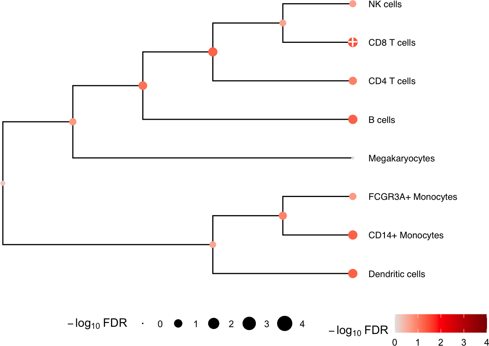

# Integration with dreamlet / SingleCellExperiment

## Load and process single cell data

Here we perform analysis of PBMCs from 8 individuals stimulated with
interferon-β [Kang, et al, 2018, Nature
Biotech](https://www.nature.com/articles/nbt.4042). We perform standard
processing with
[dreamlet](https://gabrielhoffman.github.io/dreamlet/index.html) to
compute pseudobulk before applying `crumblr`.

Here, single cell RNA-seq data is downloaded from
[ExperimentHub](https://bioconductor.org/packages/ExperimentHub/).

\
[`library`](https://rdrr.io/r/base/library.html)`(`[`dreamlet`](https://DiseaseNeurogenomics.github.io/dreamlet)`)`\
[`library`](https://rdrr.io/r/base/library.html)`(`[`muscat`](https://github.com/HelenaLC/muscat)`)`\
[`library`](https://rdrr.io/r/base/library.html)`(`[`ExperimentHub`](https://github.com/Bioconductor/ExperimentHub)`)`\
[`library`](https://rdrr.io/r/base/library.html)`(`[`scater`](http://bioconductor.org/packages/scater/)`)`\
\
`# Download data, specifying EH2259 for the Kang, et al. study`\
`eh`` ``<-`` `[`ExperimentHub`](https://rdrr.io/pkg/ExperimentHub/man/ExperimentHub-class.html)`(``)`\
`sce`` ``<-`` ``eh``[[``"EH2259"``]``]`\
\
`sce``$``ind`` ``<-`` `[`as.character`](https://rdrr.io/r/base/character.html)`(``sce``$``ind``)`\
\
`# only keep singlet cells with sufficient reads`\
`sce`` ``<-`` ``sce``[`[`rowSums`](https://rdrr.io/r/base/colSums.html)`(`[`counts`](https://rdrr.io/pkg/BiocGenerics/man/dge.html)`(``sce``)`` ``>`` ``0``)`` ``>`` ``0``, ``]`\
`sce`` ``<-`` ``sce``[``, ``colData``(``sce``)``$``multiplets`` ``==`` ``"singlet"``]`\
\
`# compute QC metrics`\
`qc`` ``<-`` `[`perCellQCMetrics`](https://rdrr.io/pkg/scuttle/man/perCellQCMetrics.html)`(``sce``)`\
\
`# remove cells with few or many detected genes`\
`ol`` ``<-`` `[`isOutlier`](https://rdrr.io/pkg/scuttle/man/isOutlier.html)`(``metric ``=`` ``qc``$``detected``, nmads ``=`` ``2``, log ``=`` ``TRUE``)`\
`sce`` ``<-`` ``sce``[``, ``!``ol``]`\
\
`# set variable indicating stimulated (stim) or control (ctrl)`\
`sce``$``StimStatus`` ``<-`` ``sce``$``stim`

### Aggregate to pseudobulk

Dreamlet creates the pseudobulk dataset:

\
`# Since 'ind' is the individual and 'StimStatus' is the stimulus status,`\
`# create unique identifier for each sample`\
`sce``$``id`` ``<-`` `[`paste0`](https://rdrr.io/r/base/paste.html)`(``sce``$``StimStatus``, ``sce``$``ind``)`\
\
`# Create pseudobulk data by specifying cluster_id and sample_id for aggregating cells`\
`pb`` ``<-`` `[`aggregateToPseudoBulk`](http://DiseaseNeurogenomics.github.io/dreamlet/reference/aggregateToPseudoBulk.md)`(``sce``,`\
`  assay ``=`` ``"counts"``,`\
`  cluster_id ``=`` ``"cell"``,`\
`  sample_id ``=`` ``"id"``,`\
`  verbose ``=`` ``FALSE`\
`)`

### Process data

Here we evaluate whether the observed cell proportions change in
response to interferon-β.

\
[`library`](https://rdrr.io/r/base/library.html)`(`[`crumblr`](https://DiseaseNeurogenomics.github.io/crumblr)`)`\
\
`# use dreamlet::cellCounts() to extract data`\
[`cellCounts`](http://DiseaseNeurogenomics.github.io/dreamlet/reference/cellCounts.md)`(``pb``)``[``1``:``3``, ``1``:``3``]`

    ##          B cells CD14+ Monocytes CD4 T cells
    ## ctrl101      101             136         288
    ## ctrl1015     424             644         819
    ## ctrl1016     119             315         413

\
`# Apply crumblr transformation`\
`# cobj is an EList object compatable with limma workflow`\
`# cobj$E stores transformed values`\
`# cobj$weights stores precision weights`\
`cobj`` ``<-`` `[`crumblr`](http://DiseaseNeurogenomics.github.io/crumblr/reference/crumblr.md)`(`[`cellCounts`](http://DiseaseNeurogenomics.github.io/dreamlet/reference/cellCounts.md)`(``pb``)``)`

### Analysis

Now continue on with the downstream analysis

\
[`library`](https://rdrr.io/r/base/library.html)`(`[`variancePartition`](http://bioconductor.org/packages/variancePartition)`)`\
\
`fit`` ``<-`` `[`dream`](http://DiseaseNeurogenomics.github.io/variancePartition/reference/dream-method.md)`(``cobj``, ``~`` ``StimStatus`` ``+`` ``ind``, ``colData``(``pb``)``)`\
`fit`` ``<-`` ``eBayes``(``fit``)`\
\
`topTable``(``fit``, coef ``=`` ``"StimStatusstim"``, number ``=`` ``Inf``)`

    ##                         logFC    AveExpr          t     P.Value  adj.P.Val         B
    ## CD8 T cells       -0.25085170  0.0857175 -4.0787416 0.002436375 0.01949100 -1.279815
    ## Dendritic cells    0.37386979 -2.1849234  3.1619195 0.010692544 0.02738587 -2.638507
    ## CD14+ Monocytes   -0.10525402  1.2698117 -3.1226341 0.011413912 0.02738587 -2.709377
    ## B cells           -0.10478652  0.5516882 -3.0134349 0.013692935 0.02738587 -2.940542
    ## CD4 T cells       -0.07840101  2.0201947 -2.2318104 0.050869691 0.08139151 -4.128069
    ## FCGR3A+ Monocytes  0.07425165 -0.2567492  1.6647681 0.128337022 0.17111603 -4.935304
    ## NK cells           0.10270672  0.3797777  1.5181860 0.161321761 0.18436773 -5.247806
    ## Megakaryocytes     0.01377768 -1.8655172  0.1555131 0.879651456 0.87965146 -6.198336

Given the results here, we see that CD8 T cells at others change
relative abundance following treatment with interferon-β.

### Multivariate testing along a tree

ere we construct a hierarchical clustering between cell types based on
gene expression from pseudobulk, and perform a multivariate test for
each internal node of the tree based on its leaf nodes. The results for
the leaves are the same as from `topTable()` above.

\
`# hierarchical cluster based on pseudobulked gene expression`\
`hcl`` ``<-`` `[`buildClusterTreeFromPB`](http://DiseaseNeurogenomics.github.io/dreamlet/reference/buildClusterTreeFromPB.md)`(``pb``)`\
\
`# Perform multivariate test across the hierarchy`\
`res`` ``<-`` `[`treeTest`](http://DiseaseNeurogenomics.github.io/crumblr/reference/treeTest.md)`(``fit``, ``cobj``, ``hcl``, coef ``=`` ``"StimStatusstim"``)`\
\
`# Plot hierarchy and testing results`\
[`plotTreeTest`](http://DiseaseNeurogenomics.github.io/crumblr/reference/plotTreeTest.md)`(``res``)`

## Session Info

    ## R version 4.5.1 (2025-06-13)
    ## Platform: aarch64-apple-darwin23.6.0
    ## Running under: macOS Sonoma 14.7.1
    ## 
    ## Matrix products: default
    ## BLAS/LAPACK: /opt/homebrew/Cellar/openblas/0.3.34/lib/libopenblasp-r0.3.34.dylib;  LAPACK version 3.12.0
    ## 
    ## locale:
    ## [1] en_US.UTF-8/en_US.UTF-8/en_US.UTF-8/C/en_US.UTF-8/en_US.UTF-8
    ## 
    ## time zone: America/New_York
    ## tzcode source: internal
    ## 
    ## attached base packages:
    ## [1] stats4    stats     graphics  grDevices utils     datasets  methods   base     
    ## 
    ## other attached packages:
    ##  [1] lubridate_1.9.5             forcats_1.0.1               stringr_1.6.0              
    ##  [4] dplyr_1.2.1                 purrr_1.2.2                 readr_2.2.0                
    ##  [7] tidyr_1.3.2                 tibble_3.3.1                tidyverse_2.0.0            
    ## [10] glue_1.8.1                  crumblr_1.4.5               muscData_1.24.0            
    ## [13] scater_1.38.1               scuttle_1.20.0              ExperimentHub_3.0.0        
    ## [16] AnnotationHub_4.0.0         BiocFileCache_3.0.0         dbplyr_2.6.0               
    ## [19] muscat_1.25.4               dreamlet_1.9.3              SingleCellExperiment_1.32.0
    ## [22] SummarizedExperiment_1.40.0 Biobase_2.70.0              GenomicRanges_1.62.1       
    ## [25] Seqinfo_1.0.0               IRanges_2.44.0              S4Vectors_0.48.1           
    ## [28] BiocGenerics_0.56.0         generics_0.1.4              MatrixGenerics_1.22.0      
    ## [31] matrixStats_1.5.0           variancePartition_2.0.1     BiocParallel_1.44.0        
    ## [34] limma_3.66.0                ggplot2_4.0.3               BiocStyle_2.38.0           
    ## 
    ## loaded via a namespace (and not attached):
    ##   [1] fs_2.1.0                  bitops_1.1-0              httr_1.4.9               
    ##   [4] RColorBrewer_1.1-3        doParallel_1.0.17         Rgraphviz_2.54.0         
    ##   [7] numDeriv_2016.8-1.1       tools_4.5.1               backports_1.5.1          
    ##  [10] R6_2.6.1                  metafor_5.2-1             lazyeval_0.2.3           
    ##  [13] mgcv_1.9-4                GetoptLong_1.1.1          withr_3.0.3              
    ##  [16] gridExtra_2.3.1           prettyunits_1.2.0         cli_3.6.6                
    ##  [19] textshaping_1.0.5         sandwich_3.1-3            labeling_0.4.3           
    ##  [22] sass_0.4.10               KEGGgraph_1.70.0          SQUAREM_2026.1           
    ##  [25] mvtnorm_1.4-2             S7_0.2.2                  blme_1.0-7               
    ##  [28] pkgdown_2.2.1             mixsqp_0.3-54             yulab.utils_0.2.5        
    ##  [31] systemfonts_1.3.2         zenith_1.12.0             dichromat_2.0-1          
    ##  [34] parallelly_1.48.0         invgamma_1.2              RSQLite_3.53.3           
    ##  [37] gridGraphics_0.5-1        shape_1.4.6.1             gtools_3.9.5             
    ##  [40] car_3.1-5                 Matrix_1.7-6              metadat_1.6-0            
    ##  [43] ggbeeswarm_0.7.3          abind_1.4-8               lifecycle_1.0.5          
    ##  [46] multcomp_1.4-32           yaml_2.3.12               edgeR_4.8.2              
    ##  [49] carData_3.0-6             mathjaxr_2.0-0            gplots_3.3.0             
    ##  [52] SparseArray_1.10.10       grid_4.5.1                blob_1.3.0               
    ##  [55] crayon_1.5.3              lattice_0.23-1            beachmat_2.26.0          
    ##  [58] msigdbr_26.1.1            annotate_1.88.0           KEGGREST_1.50.0          
    ##  [61] pillar_1.11.1             knitr_1.52                ComplexHeatmap_2.26.1    
    ##  [64] rjson_0.2.23              boot_1.3-32               estimability_2.0.0       
    ##  [67] corpcor_1.6.10            codetools_0.2-20          ggiraph_0.9.6            
    ##  [70] fontLiberation_0.1.0      ggfun_0.2.1               data.table_1.18.6.1      
    ##  [73] treeio_1.34.0             vctrs_0.7.3               png_0.1-9                
    ##  [76] Rdpack_2.6.6              gtable_0.3.6              assertthat_0.2.1         
    ##  [79] cachem_1.1.0              zigg_0.0.2                xfun_0.61                
    ##  [82] rbibutils_2.4.1           S4Arrays_1.10.1           Rfast_2.1.5.2            
    ##  [85] coda_0.19-4.1             reformulas_0.4.4          survival_3.8-12          
    ##  [88] iterators_1.0.14          statmod_1.5.2             TH.data_1.1-5            
    ##  [91] dirmult_0.1.3-5           nlme_3.1-171              pbkrtest_0.5.5           
    ##  [94] ggtree_4.0.5              fontquiver_0.2.1          bit64_4.8.6              
    ##  [97] filelock_1.0.3            progress_1.2.3            EnvStats_3.1.0           
    ## [100] bslib_0.12.0              TMB_1.9.25                irlba_2.3.7              
    ## [103] vipor_0.4.7               KernSmooth_2.23-27        otel_0.2.0               
    ## [106] colorspace_2.1-3          rmeta_3.0                 DBI_1.3.0                
    ## [109] DESeq2_1.50.2             tidyselect_1.2.1          emmeans_2.0.4            
    ## [112] curl_8.0.0                bit_4.6.0                 compiler_4.5.1           
    ## [115] httr2_1.3.0               graph_1.88.1              BiocNeighbors_2.4.0      
    ## [118] fontBitstreamVera_0.1.1   desc_1.4.3                DelayedArray_0.36.1      
    ## [121] bookdown_0.48             scales_1.4.0              caTools_1.18.4           
    ## [124] remaCor_0.0.20            rappdirs_0.3.4            digest_0.6.39            
    ## [127] minqa_1.2.8               rmarkdown_2.32            aod_1.3.3                
    ## [130] XVector_0.50.0            RhpcBLASctl_0.23-42       htmltools_0.5.9          
    ## [133] pkgconfig_2.0.3           lme4_2.1-0                sparseMatrixStats_1.22.0 
    ## [136] mashr_0.2.79              fastmap_1.2.0             rlang_1.3.0              
    ## [139] GlobalOptions_0.1.4       htmlwidgets_1.6.4         DelayedMatrixStats_1.32.0
    ## [142] farver_2.1.2              jquerylib_0.1.4           zoo_1.9-0                
    ## [145] jsonlite_2.0.0            BiocSingular_1.26.1       RCurl_1.98-1.20          
    ## [148] magrittr_2.0.5            ggplotify_0.1.3           Formula_1.2-6            
    ## [151] patchwork_1.3.2           Rcpp_1.1.2                gdtools_0.5.1            
    ## [154] ape_5.8-1                 viridis_0.6.5             EnrichmentBrowser_2.40.0 
    ## [157] stringi_1.8.9             MASS_7.3-66               plyr_1.8.9               
    ## [160] parallel_4.5.1            ggrepel_0.9.8             Biostrings_2.78.0        
    ## [163] splines_4.5.1             hms_1.1.4                 circlize_0.4.18          
    ## [166] locfit_1.5-9.12           ScaledMatrix_1.18.0       reshape2_1.4.5           
    ## [169] BiocVersion_3.22.0        XML_3.99-0.24             evaluate_1.0.5           
    ## [172] RcppParallel_6.2.1        BiocManager_1.30.27       tzdb_0.5.0               
    ## [175] nloptr_2.2.1              foreach_1.5.2             fastglmm_0.4.19          
    ## [178] clue_0.3-68               scattermore_1.2           ashr_2.2-63              
    ## [181] rsvd_1.0.5                broom_1.0.13              xtable_1.8-8             
    ## [184] tidytree_0.4.8            fANCOVA_0.6-1             viridisLite_0.4.3        
    ## [187] ragg_1.5.2                truncnorm_1.0-9           aplot_0.3.1              
    ## [190] lmerTest_3.2-1            glmmTMB_1.1.14            memoise_2.0.1            
    ## [193] beeswarm_0.4.0            AnnotationDbi_1.72.0      cluster_2.1.8.3          
    ## [196] timechange_0.4.0          GSEABase_1.72.0
